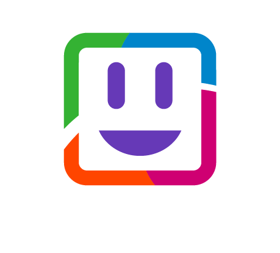

# ALE Rainbow ChatBot 



Welcome to the Alcatel-Lucent Enterprise **Rainbow ChatBot library**!

The Alcatel-Lucent Enterprise (ALE) Rainbow ChatBot is a JavaScript library for the Rainbow SDK for Node.JS.

Rainbow ChatBot allows to create **chatbot** based on JSON scenario in some lines of codes.

This documentation will help you to use it.


## Preamble

You need to have Node.JS (stable release) installed on your computer and a recent Rainbow SDK for Node.JS.

The Rainbow Bots application works on Windows, MacOSX and Linux platforms.


## Install

To install the Rainbow chatbot library, execute the following command

```bash

$ npm install --save rainbow-chatbot

```


## Rainbow account

Your need a **Rainbow** account in order to use the Rainbow Bots library.

Connect to the Rainbow API HUB to register your developer account.


## Making a chatbot

This library allows to create **chatbot** for Rainbow. A chatbot is a bot that answers to users inquiries following a pre-configured scenario.

A scenario is the actions that the bot have to do depending on the initial hashtag sent by the user.

After each inputs received from the user, a rerouting can be done to another step.


### Basic Sample

Here is the minimum code you need to add to your Node.JS application in order to load and execute your chatbot

```js

// Load the libraries
const ChatBot = require("rainbow-chatbot");
const NodeSDK = require("rainbow-node-sdk");

// Load the bot identity
const bot = require("./bot.json");

// Load the scenario
const scenario = require("./scenario.json");

// Initialize the SDK
let nodeSDK = new NodeSDK(bot);

// Connect the chat bot to the Rainbow SDK and load the scenario
let chatbot = new ChatBot(nodeSDK, scenario);
chatbot.start();

```

That's all for the JavaScript part! Now you have to configure your chatbot.

The JSON file `bot.json` contains the configuration file for the Rainbow SDK for Node.JS.

Here is a default configuration file

```JSON

{
    "rainbow": {
        "host": "sandbox.openrainbow.com",
        "mode": "xmpp"
    },
    "credentials": {
        "login": "<your login>",
        "password": "<your password>"
    },
    "logs": {
        "enableConsoleLogs": true,
        "enableFileLogs": false,
        "file": {
            "path": "/var/tmp/chatbot/",
            "level": "debug"
        }
    },
    "im": {
        "sendReadReceipt": false
    }
}

```

The JSON file `scenario.json` contains your predefined scenario(s).

Here is a basic sample scenario

```JSON

{
    "aScenario": {
        "aMessage": {
            "type": "message",
            "value": "Welcome to this basic scenario",
            "waiting": 2000,
            "next": "AChoice"
        },
        "aChoice": {
            "type": "choice",
            "value": "This is a choice",
            "list": ["Answer A", "Answer B", "Answer C"],
            "waiting": 2000,
            "next": "aLastMessage"
        },
        "aLastMessage": {
            "type": "message",
            "value": "Bye!",
            "next": null
        }
    }
}

```

### Scenario

A scenario is composed of:

- A **tag** that will be handled by the chatbot

- A list of **actions** that will be executed by the chatbot

In the previous sample, **aScenario** is the tag that the user has to send to wake-up the chatbot and start the scenario. **aMessage**, **aQuestion**, **aLastMessage** is the description of the actions done by the chatbot.


#### Action

An action is described in JSON and will be executed by the chatbot. Here is an example of a basic action:

```JSON

"aMessage": {
    "type": "message",
    "value": "This message will be sent to the user",
    "waiting": 2000,
    "next": "AQuestion"
},

```

In that example:

- **type** is the kind of action that the chatbot will execute. (See the next paragraph to have the list of supported types of action).

- **value** is the content of this action. Most of the time, this is the message sent to the user.

- **waiting** is an amount of time (in ms) that the chatbot will wait before executing the next action

- **next** is the name of the next action to execute.

Note: Depending action, more or less parameters have to be filled (See the next paragraph to have the complete description of each action).


#### Finishing a scenario

A scenario is finished when an action has no `next` step or when the next step is `null`.

When a next step don't exist, the scenario is finished automatically.

Here is an ending action:

```JSON

"aMessage": {
    "type": "message",
    "value": "This is the end...",
    "next": "null"
}

```

Which is equivalent to 

```JSON

"aMessage": {
    "type": "message",
    "value": "This is the end...",
}

```


### Handling user inputs and changing route

When there is an interaction with the user (i.e. when the user has to answer to a question or a choice), you can add a listener in order to catch the answer and decide to change the default route to another one.


#### Listening to user's answers

In order to listen to user's answers, you have to add the following lines of code in your Node.JS application:

```js

// Intercept answer for rerouting if needed
chatbot.onMessage((tag, step, content, from, done) => {
    // Do something with the input coming from a user
    ...
    done();
}, this);

```

Once the user has answered a question or a choice and before the next step is executed, this call back is fired and so let the possibility to your application to execute some code with the result obtained.

In that fonction, you have access to the following parameters:

- `tag`: The name of the current scenario that is playing

- `step`: The name to the current step executed

- `content`: The content of the message (answer) sent by the user

- `from`: The user information

- `done`: The callback to call to continue the scenario

You should call the `done()` function in order to continue the scenario. If you don't call it, the user will be blocked in the current step of the scenario.


#### Rerouting

When you call the `done()` function, you can pass a parameter corresponding to the name of the next action to execute. You scenario will be rerouted to this step and will continue.

```js

chatbot.onMessage((tag, step, content, from, done) => {

    if(step === "aStep" && content==="yes" && from.jid==="ajid@adomain.com") {
        done('special_step');
    } else {
        done();
    }
    
}, this);

```

In that sample, depending on the step, the user and the answer received, a rerouting is done to the step `special_step`. For other cases, the normal next step is executed.


### Tickets reporting

Each time a user has finished a scenario, a ticket is generated that contains all inputs received from that user associated with all actions done.

#### Listening to tickets

If you want to listen to tickets generated, you have to add the following code:

```js

chatbot.onTicket((tag, history, from, startdate, enddate) => {
    // Do something with the ticket
    ...
}, this);

```

This callback will receive:

- `tag`: The name of the current scenario that is playing

- `history`: An array of {`step`, `content`} representing each inputs received from the user during this scenario

- `from`: The user information

- `startdate`: The date when the scenario has started for this user

- `enddate`: The date when the scenario has finished for this user

#### Tickets storage

It's up to your application to store tickets. Once generated, tickets are not saved by the chatbot. If you don't catch them and store them, tickets will be lost.


### Actions

At this time of writing, Rainbow Bots supports the following actions:

- **Message**: For sending a message to the user

- **Choice**: For asking the user to choose between a list of possible answer

- **Question**: For asking a free answer from the user

- **External**: For giving the hang to the Node.JS application without interaction with the user

- **Command**: For sending a command to execute (Unofficially supported)


#### Message action

You can use this action to send a message to a user without expecting an answer.

This action allows to

- Send a message

- Wait or not during a among of time before going to the next step of the scenario


Here is a basic example of sending a message and then waiting 2s before executing the next step:

```json

{
    "aMessage": {
        "type": "message",
        "value": "This message will be sent to the user and then the bot will wait 2000ms before continuing the scenario",
        "waiting": 2000,
        "next": "..."
    }
}

```

The parameter `waiting` accepts a non-negative integer and represents the number of milliseconds to wait before executing the next step.

If you don't want to wait, you can simply add the following JSON:

```json

{
    "aMessage": {
        "type": "message",
        "value": "This message will be sent to the user and then the next step of the scenario will be executed",
        "next": "..."
    }
}

```

#### Question action

The question action allows to ask the user for an open question which means without providing a list of acceptable answers.

For using this action, you have to provide:

- The question

- And optionnaly, you can wait during a among of time before going to the next step of the scenario

Here is an exemple of asking a question and then waiting for 5 secondes before executing the next action

```JSON

{
    "aQuestion": {
        "type": "question",
        "value": "This is an open question",
        "waiting": 5000,
        "next": ""
    }
}

```

#### Choice action

This action can be used to propose a choice to the user in order to be sure that the user only sends an expected input.

If the user sends an input that is not expected, the same question is sent again.

This action allows to provide:

- The question

- The list of expected answers

- Optionnaly an error message if the answer is not in the list of proposed choice

- Optionnaly, a among of time before going to the next step of the scenario

Here is an example of a choice action:

```JSON

"aChoice": {
    "type": "choice",
    "value": "This is a choice",
    "list": ["Answer A", "Answer B", "Answer C"],
    "invalid": "Only the proposed answers are valid",
    "waiting": 2000,
    "next": "nextStep"
},

```

The parameter `list` contains the choices proposed to the user and expected by the chatbot.

The parameter `invalid` allows to inform the user that is answer is not correct. If there is no parameter `invalid`, no message is sent to the user. In both cases, the chatbot will wait for a right answer (answer that belongs to the list of predefined answers that are listed in the parameter `list`).

In that sample, whatever the user sends, the next action called will be `nextstep`

You can provide a dedicated route for each answer. In that case, the `next` parameter contains several action's names. Each name corresponding to an answer.

In the following sample, if the user sends `yes`, the next route will be `route_to_yes` else the `route_to_no` will be executed.

```JSON

"aChoice": {
    "type": "choice",
    "value": "Choose your route !",
    "list": ["yes", "no"],
    "invalid": "Only the proposed answers are valid",
    "waiting": 2000,
    "next": ["route_to_yes", "route_to_no"]
},

```

Note: When using this possibility, you need to take care to have exactly one route defined per expected answer. If not, the user will not be able to reach the end of your scenario.

Note: When forcing the route using the `onMessage()` handler and passing a new route with the function `done(...)`. The forced route will be user prioritary to the route defined in the `next` parameter.


### Samples

There is a sample that can be launched that proposes several scenarios.

To test the chatbot, launch the following command:

```bash

$ node samples/sample_message.js

```

Note: Don't forget to modify the file `bot.json` to enter you own credentials
